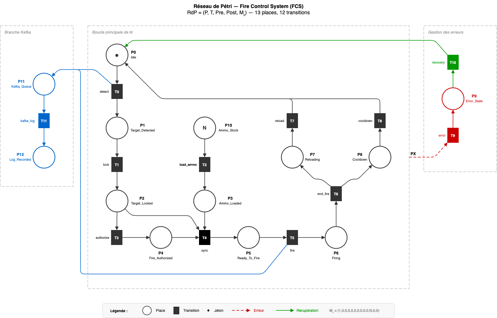

# Fire Control System (FCS)

Modélisation formelle et vérification d'un système de contrôle de tir pour vehicule blinde.

Le systeme combine une **implementation distribuee** en Scala/Akka (modele d'acteurs) avec un **reseau de Petri** (13 places, 12 transitions) et une **verification formelle** complete (invariants, LTL, P/T-invariants, bornitude, vivacite).



## Prerequis

| Outil | Version |
|-------|---------|
| JDK | 21+ |
| sbt | 1.10+ |
| Apache Kafka | 3.x *(optionnel, mode simulation uniquement)* |

## Installation

```bash
git clone https://github.com/mcrayssac/Fire-Control-System.git
cd Fire-Control-System
sbt compile
```

## Utilisation

| Commande | Resume |
|---|---|
| `sbt compile` | Compile le projet (sources principales + dependances). |
| `sbt test` | Lance les tests unitaires et la verification formelle (invariants, LTL, analyse structurelle). |
| `sbt "run akka-demo"` | Lance la demonstration du systeme Akka/Kafka (scenario nominal). Par defaut: attente de `ENTREE` si une console interactive est detectee, sinon arret automatique apres 10 secondes. En CI, le timeout est force. Override possible via `-Dfcs.akkaDemo.shutdownMode=wait|timeout` ou `FCS_AKKA_DEMO_SHUTDOWN_MODE=wait|timeout`. |
| `sbt "run conformance"` | Lance la verification de conformite Akka vs modele formel (Petri Net) avec rapport compare. |
| `sbt "run live"` | Lance le panneau interactif (mode **verbose** par defaut). Option: `sbt "run live compact"`. |

## Structure du projet

```
src/main/scala/fcs/
├── Main.scala                  # Point d'entree (akka-demo / conformance / live)
├── actors/                     # 8 acteurs Akka Typed
├── model/                      # Messages et etats du systeme
├── kafka/                      # Configuration Kafka
└── petri/                      # Modele formel et verification
    ├── PetriNet.scala          # Modele (Marking, Transition, PetriNet)
    ├── FCSPetriNet.scala       # Reseau de Petri FCS
    ├── StateSpaceAnalyzer.scala
    ├── InvariantChecker.scala  # INV1-INV10
    ├── InvariantAnalysis.scala # P/T-invariants, bornitude, vivacite
    ├── LTLVerifier.scala       # 6 proprietes LTL
    └── TraceComparator.scala   # Simulation comparee

docs/
├── projet_2026.pdf             # Consigne du projet
├── fcs_petri_net.drawio        # Diagramme du reseau de Petri
├── fcs_petri_net.drawio.png    # Export PNG du diagramme
└── rapport/                    # Rapport detaille (6 sections)
```

## Couverture des objectifs du projet

Correspondance entre les attentes de la consigne (`docs/projet_2026.pdf`) et les livrables du projet :

| # | Objectif (consigne) | Fichiers sources | Rapport |
|---|---|---|---|
| 2.1 | **Etat de l'art** — verification formelle, reseaux de Petri, LTL | — | `docs/rapport/01_etat_de_lart.md` |
| 2.2 | **Modelisation fonctionnelle** — acteurs Akka, flux de messages, concurrence, supervision, tests | `src/main/scala/fcs/actors/` `src/main/scala/fcs/model/` `src/test/scala/fcs/actors/` | `docs/rapport/02_architecture.md` |
| 2.3 | **Traduction vers un modele formel** — reseau de Petri, espace d'etats | `src/main/scala/fcs/petri/FCSPetriNet.scala` `src/main/scala/fcs/petri/StateSpaceAnalyzer.scala` `docs/fcs_petri_net.drawio` `docs/fcs_petri_net.drawio.png` | `docs/rapport/03_modele_formel.md` |
| 2.4 | **Verification de proprietes** — transitions, deadlocks, invariants metier, LTL | `src/main/scala/fcs/petri/InvariantChecker.scala` `src/main/scala/fcs/petri/InvariantAnalysis.scala` `src/main/scala/fcs/petri/LTLVerifier.scala` | `docs/rapport/04_verification.md` |
| 2.5 | **Simulation et validation** — simulation Akka, comparaison reel vs formel | `src/main/scala/fcs/Main.scala` `src/main/scala/fcs/petri/TraceComparator.scala` | `docs/rapport/05_simulation_comparee.md` |
| 2.6 | **Mode live interactif** — panneau de commande, modes verbose/compact, UX operateur | `src/main/scala/fcs/Main.scala` `src/main/scala/fcs/petri/InteractiveSimulator.scala` `src/test/scala/fcs/petri/InteractiveSimulatorSpec.scala` | `docs/rapport/06_mode_live_interactif.md` |

| # | Livrable attendu (section 4) | Localisation |
|---|---|---|
| 1 | Sources bibliographiques de reference | `docs/rapport/01_etat_de_lart.md` (section References) |
| 2 | Modele Akka/Scala fonctionnel | `src/main/scala/fcs/actors/` — 8 acteurs, 68 tests |
| 3 | Reseau de Petri des comportements critiques | `src/main/scala/fcs/petri/FCSPetriNet.scala` + `docs/fcs_petri_net.drawio` + `docs/fcs_petri_net.drawio.png` |
| 4 | Rapport de verification (proprietes + invariants) | `docs/rapport/04_verification.md` |
| 5 | Simulation comparee reel vs formel | `sbt "run conformance"` + `docs/rapport/05_simulation_comparee.md` |
| 6 | Rapport mode live interactif | `docs/rapport/06_mode_live_interactif.md` |
| 7 | Lien GitHub | https://github.com/mcrayssac/Fire-Control-System |

## Contributeurs

- Paul Pitiot
- Maxime Crayssac
- Arthur Neuez
